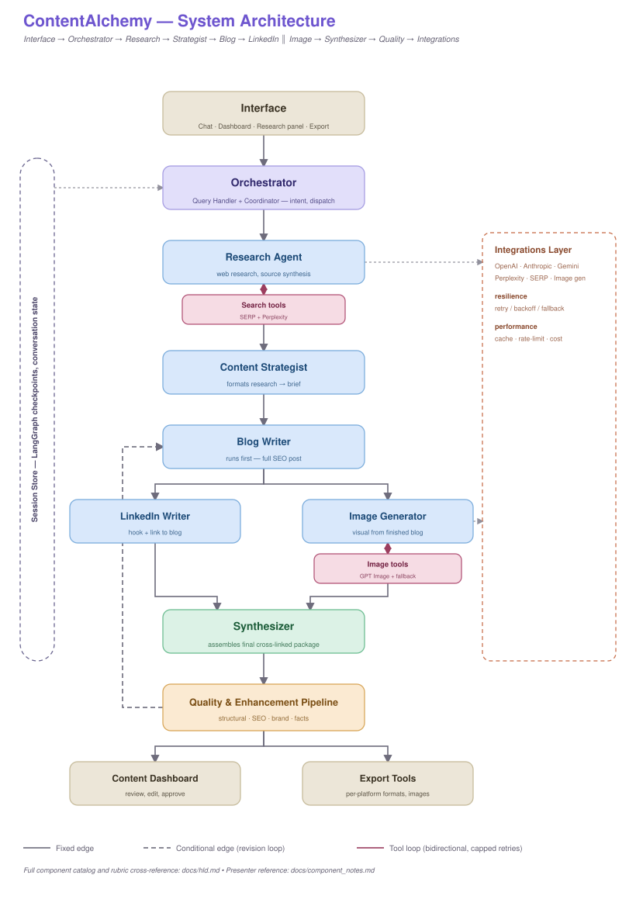

# ContentAlchemy — Multi-Agent Content Marketing Assistant


**ContentAlchemy** is a multi-agent content marketing assistant that turns a single
request into a research-backed, cross-linked content package — a full SEO blog post, a
LinkedIn post, and a matching image — built on LangGraph. It is being built to fulfill
the capstone requirements for the Interview Kickstart Applied Agentic AI for SWEs
program.

> **Project status:** design phase. The architecture below is finalized (see
> [`architecture.svg`](architecture.svg) and
> [`docs/hld.md`](docs/hld.md)); implementation has not started yet. Sections below
> describe the intended system, not a working build — see
> [Project Status & Milestones](#project-status--milestones) for what's done vs. planned.

---
## Quick Start

*(The project scaffold exists — `src/`, `tests/`, `config/` — but the agents and
workflow are still empty stubs. Running the app below won't yet produce real content;
this is the intended flow once they're implemented.)*

Python 3.12 is required — exactly, not just "3.x". [uv](https://docs.astral.sh/uv/)
is used for dependency management; install it first if you don't have it.

1. **Clone the repository:**

```bash
git clone https://github.com/yourusername/contentalchemy.git
cd contentalchemy
```

2. **Set up environment variables:**

```bash
cp .env.example .env
# then fill in your API keys
```

3. **Create a virtual environment.** Important: use Python 3.12 — on Windows, if
   your default `python` points to a different version, use `py -3.12` instead.

**Windows (PowerShell):**
```powershell
py -3.12 -m venv .venv
.venv\Scripts\activate
```

**macOS/Linux:**
```bash
python3.12 -m venv .venv
source .venv/bin/activate
```

4. **Install dependencies and run:**

```bash
uv pip install -r requirements.txt
uv run streamlit run src/web_app/streamlit_app.py
```

---
### Tests

```bash
uv run pytest tests/ --cov=src --cov-report=term-missing
```

---
## Table of Contents

- [Overview](#overview)
- [Features](#features)
- [Architecture](#architecture)
  - [System Architecture](#system-architecture)
  - [Data Flow](#data-flow)
  - [Edge Semantics](#edge-semantics)
- [Technology Stack](#technology-stack)
- [Project Structure](#project-structure)
- [Installation & Setup](#installation--setup)
- [Configuration](#configuration)
- [Agent System](#agent-system)
- [Quality & Enhancement Pipeline](#quality--enhancement-pipeline)
- [Session & State Management](#session--state-management)
- [Testing](#testing)
- [Project Status & Milestones](#project-status--milestones)
- [Rubric Cross-Reference](#rubric-cross-reference)
- [Documentation](#documentation)
- [Contributing](#contributing)
- [License](#license)

---

## Overview

ContentAlchemy routes a single user request through one orchestrated LangGraph graph
rather than exposing separate tools per content type. The core insight driving the
architecture: **the blog post and image generate in parallel**, both off the Content
Strategist's brief, while the **LinkedIn post still waits on the finished blog** — its
hook links back to the actual post, so it can't start from the raw brief the way the
image can.

The system:

- **Researches** a topic across multiple sources with citations
- **Drafts** a full SEO blog post and header image in parallel from the same brief,
  then a LinkedIn post once the blog is finished
- **Synthesizes** the three outputs into one cross-linked package
- **Validates** structure, SEO, brand voice, and facts — looping back for revision on
  failure
- **Persists** conversation state so follow-up refinement requests keep context

Full component-level detail lives in [`docs/hld.md`](docs/hld.md); a presenter's
walkthrough of each box in the diagram lives in
[`docs/component_notes.md`](docs/component_notes.md).

---

## Features

### Core Capabilities (planned)

- ✅ **Multi-Agent Architecture** — six specialized agents, intelligently orchestrated
- ✅ **Research-First Workflow** — multi-source web research with source citations
- ✅ **Parallel Content Generation** — blog and image generate together off the brief;
  LinkedIn waits on the finished blog since it links back to it
- ✅ **Quality & Enhancement Pipeline** — structural, SEO, brand, and fact-check gates
  with an automatic revision loop
- ✅ **Multi-Provider Integrations** — OpenAI, Anthropic, Gemini for text; SERP API +
  Perplexity for research; GPT Image + fallback for visuals
- ✅ **Resilience by Default** — retry/backoff/fallback and rate-limit/cost handling
  centralized in one integrations layer, not duplicated per agent
- ✅ **Conversation Memory** — LangGraph-checkpointed session state across turns

### User Experience (planned)

- 🎨 Conversational chat interface for content requests
- 📊 Content Dashboard for reviewing, editing, and approving drafts before publishing
- 🔍 Research panel with source attribution
- 🖨️ Export Tools for per-platform formats (Markdown, HTML, plain text, PDF, images)

---

## Architecture

### System Architecture



*(Full component catalog and rubric cross-reference: [`docs/hld.md`](docs/hld.md). Presenter walkthrough: [`docs/component_notes.md`](docs/component_notes.md).)*

### Data Flow

```
┌─────────────────────────────────────────────────────────────────┐
│ 1. User Request                                                 │
│    • User asks for content via Interface                        │
│    • Orchestrator classifies intent, checks Session Store       │
└────────────────────────────┬────────────────────────────────────┘
                             │
                             ▼
┌─────────────────────────────────────────────────────────────────┐
│ 2. Research                                                     │
│    • Research Agent <=> Search tools (SERP + Perplexity)        │
│    • Capped-retry tool loop; results include citations          │
└────────────────────────────┬────────────────────────────────────┘
                             │
                             ▼
┌─────────────────────────────────────────────────────────────────┐
│ 3. Strategy                                                     │
│    • Content Strategist formats research into a brief           │
│      (angle, outline, key points, target keywords, image brief) │
└────────────────────────────┬────────────────────────────────────┘
                             │
                 ┌───────────┴───────────┐
                 ▼                       ▼
┌───────────────────────────┐ ┌───────────────────────────────────┐
│ 4a. Blog Writer           │ │ 4b. Img Generator → Image tools   │
│    full SEO post          │ │    visual from the brief's        │
│      │                    │ │    image_brief — does NOT wait    │
│      ▼                    │ │    on the blog. Single-shot call, │
│ 4c. LinkedIn Writer       │ │    provider fallback (not a tool  │
│    hook + link to blog    │ │    loop)                          │
│    (waits on 4a)          │ │                                   │
└────────────────┬──────────┘ └──────────┬────────────────────────┘
                 └───────────┬───────────┘
                             ▼
┌─────────────────────────────────────────────────────────────────┐
│ 5. Synthesis                                                    │
│    • Synthesizer assembles blog + LinkedIn + image into one     │
│      cross-linked package                                       │
└────────────────────────────┬────────────────────────────────────┘
                             │
                             ▼
┌─────────────────────────────────────────────────────────────────┐
│ 6. Quality Gate                                                 │
│    • Structural, SEO, brand, and fact checks                    │
│    • Pass → Dashboard + Export                                  │
│    • Fail → conditional edge back to Blog Agent (capped retries)│
└─────────────────────────────────────────────────────────────────┘
```

### Edge Semantics

| Edge type | Meaning |
|---|---|
| Fixed edge | Deterministic hand-off, always taken |
| Conditional edge (revision loop) | Taken only when the Quality & Enhancement Pipeline fails a gate; routes back for revision, capped retries |
| Tool loop (bidirectional, capped retries) | Agent ⇄ tool call-and-response (Search tools, Image tools) |

See [`docs/hld.md`](docs/hld.md#4-edge-semantics-see-diagram-legend) for the full
component catalog behind each node.

---

## Technology Stack

### Core Framework
- **Python 3.12**
- **LangGraph** — state machine and workflow orchestration, conditional revision loop
- **LangChain** — LLM orchestration primitives

### LLM Integration
- **OpenAI GPT-4o** — primary
- **Anthropic Claude Sonnet**, **Google Gemini** — alternative providers via a shared
  abstraction (see [Integrations Layer](docs/hld.md#integrations-layer))

### Research
- **SERP API + GPT** — primary, more control over sources
- **Perplexity Sonar** — alternative, faster pre-analyzed results

### Image Generation
- **GPT Image** — primary
- Fallback chain to a secondary provider / placeholder on failure

### User Interface
- **Streamlit** — chat, dashboard, research panel, export tools

### State Management
- **LangGraph checkpointer** — conversation/workflow persistence (Session Store)

*(Alternatives considered for each layer — CrewAI vs. LangGraph, Tavily vs. SERP,
FastAPI+React vs. Streamlit — are discussed in the
[Service Comparison](#project-status--milestones) deliverable, per the capstone's
submission guidelines.)*

---

## Project Structure

Following the structure proposed in the capstone problem statement:

```
contentalchemy/
├── src/
│   ├── agents/
│   │   ├── base_agent.py            # shared LLM/tool-loop machinery (BaseAgent)
│   │   ├── query_handler.py         # Orchestrator: intent + dispatch
│   │   ├── research_agent.py
│   │   ├── content_strategist.py
│   │   ├── blog_writer.py
│   │   ├── linkedin_writer.py
│   │   └── image_generator.py
│   ├── core/
│   │   ├── config.py
│   │   └── router.py                # pure conditional-edge routing functions
│   ├── integrations/
│   │   ├── resilience.py            # shared retry/backoff decorator
│   │   ├── performance.py           # shared TTL cache + rate limiter
│   │   ├── openai_client.py
│   │   ├── serp_client.py
│   │   ├── perplexity_client.py
│   │   └── image_clients.py
│   ├── web_app/
│   │   ├── streamlit_app.py
│   │   ├── components/
│   │   └── static/
│   ├── utils/
│   │   ├── content_optimization.py
│   │   ├── quality_validation.py
│   │   └── export_tools.py
│   └── workflow/
│       ├── langgraph_workflow.py    # StateGraph assembly (the LangGraph graph definition)
│       ├── synthesizer.py           # deterministic content_package assembly
│       └── state_management.py
├── tests/
│   ├── unit/
│   ├── integration/
│   └── e2e/
├── config/
│   ├── development.yaml
│   ├── production.yaml
│   └── services.yaml
├── docs/
│   ├── hld.md                       # full component catalog + rubric cross-ref
│   └── component_notes.md           # presenter reference for the demo video
├── architecture.svg
├── requirements.txt
├── docker-compose.yml
├── .env.example
└── README.md
```

The original scaffold had an overlapping `core/workflow.py` alongside `workflow/langgraph_workflow.py`; it's been removed — the graph and its checkpointing are one cohesive unit in `workflow/`, while `core/` stays reserved for app-wide config and pure routing-decision functions.

---

## Installation & Setup

### Prerequisites

- **Python 3.12** exactly — if your default `python`/`python3` resolves to a
  different version, pin it explicitly (`py -3.12` on Windows, `python3.12` on
  macOS/Linux) when creating the virtual environment below
- **[uv](https://docs.astral.sh/uv/)** for dependency management
- API keys for at least one LLM provider, one research provider, and one image
  provider (see [Configuration](#configuration))

### Setup

**Windows (PowerShell):**
```powershell
py -3.12 -m venv .venv
.venv\Scripts\activate
uv pip install -r requirements.txt
```

**macOS/Linux:**
```bash
python3.12 -m venv .venv
source .venv/bin/activate
uv pip install -r requirements.txt
```

Create a `.env` file (see [Configuration](#configuration) for the full variable list),
then run:

```bash
uv run streamlit run src/web_app/streamlit_app.py
```

Access the application at `http://localhost:8501`.

---

## Configuration

### Environment Variables

| Variable | Description | Required |
|---|---|---|
| `OPENAI_API_KEY` | Primary LLM + image generation provider | Yes |
| `ANTHROPIC_API_KEY` | Alternative LLM provider | No |
| `GOOGLE_API_KEY` | Alternative LLM provider (Gemini) | No |
| `SERPAPI_API_KEY` | Primary research backend | Yes |
| `PERPLEXITY_API_KEY` | Alternative research backend | No |
| `SESSION_STORE_URL` | Backing store for LangGraph checkpoints (Redis/Postgres); falls back to in-memory for local dev | No |

---

## Agent System

### Orchestrator (Query Handler)

**Purpose:** classifies user intent and routes to the right entry point — new content
request, refinement of existing content, or research-only.

**Routing logic:** `OrchestratorAgent.decide()` (`src/agents/query_handler.py`) calls the
LLM with structured output (`OrchestratorDecision`) to classify `intent`
(`new_content`/`refinement`) and one or more `targets`
(`research`/`blog`/`linkedin`/`image`/`package`), then dispatches via LangGraph's
`Send()`. Conversation context from the Session Store (existing blog/LinkedIn/image
flags) is included so follow-ups ("make it punchier") route correctly without
re-explaining the topic; a safety net forces `research` whenever no blog exists yet,
regardless of what the model decides.

### Research Agent

**Purpose:** multi-source web research with citations, via a swappable backend
(SERP API + GPT primary, Perplexity Sonar as fallback/alternative).

### Content Strategist

**Purpose:** turns raw research into a structured brief — angle, outline, key points,
target keywords, and an image brief — that fans out to the Blog Writer and Image
Generator in parallel.

### Blog Writer

**Purpose:** full-length, SEO-optimized post. Runs in parallel with Image Generator
(both fed by the Content Strategist's brief), but still before LinkedIn Writer, since
the LinkedIn hook needs the finished piece, not the raw brief.

**Planned optimizations:** keyword density (1–2% target keyword), meta description
(150–160 chars), H1/H2/H3 structure, Flesch-Kincaid readability scoring.

### LinkedIn Writer

**Purpose:** short-form post with a hook and a link back to the blog. Runs after Blog
Writer finishes (a real dependency — it links to the finished post).

**Planned optimizations:** 1,300–1,600 characters, 8–12 relevant hashtags, engagement
hook + CTA, line-break formatting for readability.

### Image Generator

**Purpose:** its own agent with a dedicated system prompt, so generated images follow
a consistent house style. Runs in parallel with Blog Writer, straight off the Content
Strategist's `image_brief` (subject matter/mood) — it does not wait on the finished
blog. Writes an image-generation prompt from that brief, then calls the image API
through a fallback chain (primary provider → secondary → placeholder) so a provider
outage never blocks the pipeline.

---

## Quality & Enhancement Pipeline

Runs after the Synthesizer assembles the blog + LinkedIn + image package, before
anything reaches the Content Dashboard:

- **Structural** — required sections present, headings well-formed
- **SEO** — keyword targets, meta description, header hierarchy
- **Brand** — tone/voice consistency across all three formats
- **Facts** — claims traceable back to Research Agent citations

A failed gate triggers the **conditional revision edge** back to the Blog Writer /
Content Strategist, capped to a fixed number of retries to avoid infinite loops —
see [`docs/hld.md`](docs/hld.md#3-component-catalog) for the full gate design.

---

## Session & State Management

Conversation and workflow state is persisted via **LangGraph's built-in checkpointer**,
keyed by session ID, so multi-turn refinement requests re-enter the graph with full
context instead of starting over. Every stage in the pipeline can read and write this
state — it's drawn as a side rail spanning the full diagram for that reason.

---

## Testing

Planned split (per the capstone's submission guidelines, targeting 80%+ coverage):

- **Unit tests (40%)** — individual agent functionality, content generation quality,
  error handling and edge cases
- **Integration tests (30%)** — multi-agent workflows, API service interactions,
  fallback mechanisms
- **End-to-end tests (30%)** — complete user workflows, content generation pipelines,
  UI interactions

```bash
uv run pytest tests/ --cov=src --cov-report=term-missing
```

**Routing accuracy eval:** `scripts/eval_routing.py` runs the Orchestrator's real LLM
classification against a labeled set of `(query, expected_targets)` cases
(`src/evaluation/routing_cases.py`) and reports an accuracy score, so a prompt change
to `ORCHESTRATOR_PROMPT` can be checked for regressions before it ships. Requires a
configured LLM provider key (see [Environment Variables](#environment-variables)).

```bash
uv run python scripts/eval_routing.py
uv run python scripts/eval_routing.py --provider anthropic --threshold 0.9
```

---

## Project Status & Milestones

**Done:**
- ✅ Architecture design ([`architecture.svg`](architecture.svg), [`docs/hld.md`](docs/hld.md))
- ✅ Presenter/demo reference ([`docs/component_notes.md`](docs/component_notes.md))
- ✅ Project scaffold — `src/`, `tests/`, `config/` laid out per [Project Structure](#project-structure); all modules are currently empty stubs

**Planned:**
1. Service integration & configuration (provider abstraction, fallback, rate limiting)
2. Core agent implementation (Orchestrator, Research Agent, Content Strategist)
3. Content creation agents (Blog Writer, LinkedIn Writer, Image Generator)
4. Smart routing & workflow orchestration (LangGraph graph, conversation memory)
5. Image generation pipeline (multi-provider, prompt optimization, fallback)
6. Content optimization engine (SEO, platform formatting, brand voice, scoring)
7. UI development (chat, dashboard, research panel)
8. Testing & QA
9. Documentation & deployment
10. *(Stretch)* CMS integration (WordPress, Ghost, Medium)

---

## Rubric Cross-Reference

Full mapping of every architecture component to its grading-rubric line item is in
[`docs/hld.md`](docs/hld.md#5-rubric-cross-reference). Summary by weight:

| Category | Weight |
|---|---|
| Technical Implementation | 50% |
| Content Creation Capabilities | 30% |
| User Experience & Interface | 10% |
| Code Quality & Documentation | 10% |
| Innovation & Future Outlook | up to +10 bonus |

---

## Documentation

- [`docs/hld.md`](docs/hld.md) — full component catalog, edge semantics, rubric cross-reference, open design questions
- [`docs/component_notes.md`](docs/component_notes.md) — presenter reference for demo/walkthroughs
- [`architecture.svg`](architecture.svg) — the architecture diagram itself

---

## Contributing

This is a capstone project for the Interview Kickstart Applied Agentic AI for SWEs
program. Issues and suggestions are welcome once the codebase lands.

## License

Apache 2.0
